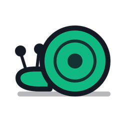

# Layer8Problem

> *"The problem is usually located about 30 cm in front of the screen."*

**A satirical sysadmin simulator.** You are GlobalCorp's IT department. One
person. For everyone. Between Chantal from marketing, a boss who thinks IT is
voodoo, and a ticket counter that never runs backwards.

### [▶ Play in the browser](https://seluce.github.io/Layer8Problem) · [Buy on Steam](https://store.steampowered.com/app/4487580/Layer8Problem/)

Free in the browser, no sign-up, no download. Runs on a phone as well as on a
desktop.

---

## Two ways to play

**Working Day** — one shift, 08:00 to 16:30. Survive until clocking-off time.
By evening everything is forgotten and tomorrow you start from zero again.
Choose beforehand how much you hate your life: a relaxed Friday, an ordinary
Wednesday, or a Monday.

**Working Week** — Monday to Friday in one go. Nothing is forgotten overnight:
what you leave lying around today is still lying there tomorrow. Your backpack
comes with you, so does your reputation, and your laziness certainly does. The
valve and the written warning come once per week, not once per day. Fail, and
you lose the whole week.

## What it is about

Every 30 minutes a ticket lands in your system. At ten open tickets it
collapses and you are out. So you take calls, run to the server room, fetch
coffee and go on errands — keeping an eye on three values while you do:

| | |
|---|---|
|  **Laziness** | The higher it is, the harder the boss punishes your mistakes. |
|  **Aggro** | At 100 % you blow up. The valve opens exactly once. |
|  **Boss Radar** | At 100 % you get a written warning. After that, the sack. |

Every decision costs time, and the clock only runs one way.

## What to expect

- **Over 1,300 events** in the server room, the coffee kitchen, on the phone, out
  on errands and in your inbox — plus boss fights, lunch breaks and a company
  gala that only the most stubborn ever get to see.
- **German and English**, in full — not just the menus, but every single event.
  You can switch mid-game: the save file does not depend on the language, so the
  week carries on exactly where it was.
- **Decisions with a memory.** The machine you had Kevin reinstall turns up in
  the rack hours later — with a dragon sticker and a program selling compute
  power overseas. Leave Gabi hanging and you will find a drawer in the tea
  kitchen that was not there before.
- **Seven colleagues with their own reputation**, who remember how you decided —
  and pay you back eventually. In both directions.
- **32 items** to find and repurpose creatively. Duct tape fixes more than it
  should, and some things work without being touched at all.
- **27 achievements**, graded by difficulty, plus an archive, a diary that
  narrates your day every evening, and a company chronicle to keep writing.
- **Full keyboard support** with freely assignable keys. There is a tutorial
  too, if you would rather be walked through it.

## Why Steam, when it runs for free?

The game stays complete and free in the browser. Anyone who wants to support
development gets a few technical conveniences on Steam:

- **Playable offline** — on the train, on a plane, in the server basement
- **Steam achievements** and **global statistics** — see how often the rest of
  the world has thrown in the towel
- **Cloud saves** — archive, achievements and statistics travel with you, and so
  does the run in progress: start at lunchtime on the laptop, carry on suffering
  at the desktop in the evening
- **Dynamic status** — your friends list finds out whether you are currently
  *"Hiding in the server room"* or *"Surviving the Synergy Gala"*

Both versions run on the same content.

---

## For developers

Svelte 5 (runes), Vite, Tailwind CSS 4. The Steam version is the same
application in Electron. The web version is served from `main:/docs` via GitHub
Pages, so the build is committed along with the source.

```bash
npm install
npm run dev            # development server on port 8080
npm run build          # build into docs/
npm run preview        # inspect the built version (do not open it by double-click)
```

**The game data exists twice:** `src/data/de/` is the source, `src/data/en/` the
English version — 23 files each. Both carry the same ids, story flags, character
names and numbers; only the prose differs. That is what makes a save file
language-independent. Touch one file and you touch both.

Tools live in `tools/`:

```bash
npm run lint:all       # the gate: data (both trees), interface strings, parity
npm run lint:data      # the German data tree only
npm run lint:parity    # holds the two trees against each other
npm test               # four test suites, run in both languages
npm run sim            # simulates thousands of working days for balance
npm run sim:week       # the same for whole weeks
```

If you would like to write events: `EVENTS.md` explains the data format, from
the simple option to the branching dialogue chain. `STRUCTURE.md` explains why
which file lives where, and `tools/TOOLS.md` describes every tool in detail.

## Licence & small print

Pure satire. Any resemblance to real people, companies or choleric superiors is
coincidental, but probably unavoidable.

The web version and the source code are under the **MIT licence**. You may
study the code, use it and modify it for your own non-commercial spin-offs —
please with attribution (**seluce**).

---

*Made with a great deal of caffeine, duct tape and attention to detail.*
